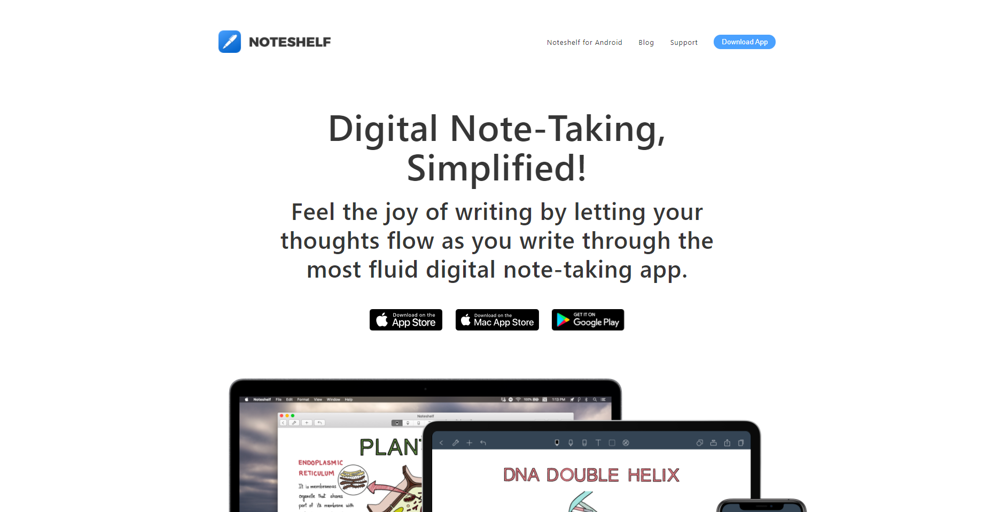

# Projeto 2

## Javascript e AJAX

> Aluna: Leticia Caroline Leonardo RA: 2209810

> O segundo projeto tem como objetivo dar continuidade na pagina web elaborada no [PROJETO 1](https://levxyca.com/noteshelf/), implementando rotinas de processamento no lado cliente.

Feito com 💙 por [levxyca](https://levxyca.com/)
